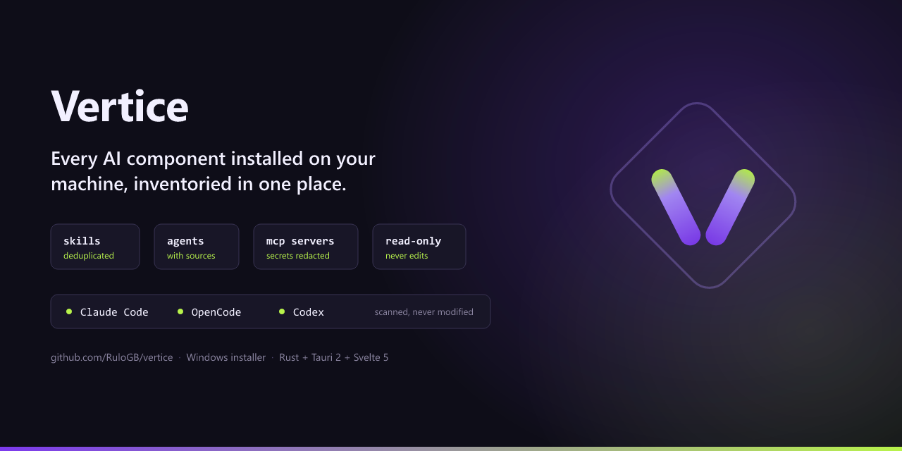

<p align="center">
  
</p>

<p align="center">
  <strong>Every AI component installed on your machine, inventoried in one place.</strong><br>
  <em>You installed the same skill three times, in three clients, and you no longer remember where. Vertice scans your machine and answers that — without touching a single one of your files.</em>
</p>

<p align="center">
  <a href="https://github.com/RuloGB/vertice/releases/latest"></a>
  <a href="#license"></a>
  
  
</p>

<p align="center">
  <a href="#the-problem">The problem</a> &bull;
  <a href="#what-vertice-does">What it does</a> &bull;
  <a href="#install-windows">Install</a> &bull;
  <a href="#inside-the-app">Inside the app</a> &bull;
  <a href="#how-it-works">How it works</a> &bull;
  <a href="#privacy-what-leaves-your-machine">Privacy</a> &bull;
  <a href="#build-from-source">Build from source</a> &bull;
  <a href="#architecture">Architecture</a>
</p>

---

## The problem

Your AI tooling is no longer one client. It is Claude Code, plus OpenCode, plus Codex, plus whatever you tried last month and never uninstalled. Each one keeps its own skills, its own agents and its own MCP servers, in its own folder, under its own naming convention.

So the questions that should be trivial are not:

- Which skills do I actually have installed — and which of them are *the same skill* seen from three different clients?
- Which MCP servers is each client configured to launch, and where does that configuration live?
- Which client versions am I running, and are any of them behind?

The answer today is a tour of `~/.claude`, `~/.config/opencode`, `~/.codex`, several JSON files and a lot of guessing. Vertice replaces that tour with a window.

## What Vertice does

Vertice reads what is already on disk and turns it into an inventory you can browse.

- 🔎 **One scan, every client** — skills, agents and MCP servers from Claude Code (npm install and the runtime bundled with the desktop app), OpenCode and Codex, each installation detected separately with its own version.
- 🧬 **Duplicates collapse, sources don't** — the same skill installed in three clients becomes **one** entry with **three** locations. You see one thing, and you still see everywhere it lives.
- 🔒 **Read-only by construction** — Vertice never writes outside its own application data directory. Not a formatter, not a package manager, not a migration tool. It looks, and that is all it does.
- 🛡️ **MCP secrets are redacted structurally** — for each MCP server it captures the *names* of `env` and header keys, never their values, never `args`, never the userinfo or query string of a remote URL. A token cannot leak through a screen that was never given one.
- 🕒 **Optional freshness check** — compares the client versions it found against the public release feeds (npm registry, GitHub releases) and marks each one up to date, outdated or unknown. Enabled by default, disclosed on first run, and switchable off for good.
- 📝 **Prompt library** — your reusable prompts, stored locally, searchable by title, tags, body or "best for" context, one click to copy.
- 💳 **Subscription tracker** — what you pay for AI each month, in one list, with renewal dates.
- 🌍 **English and Spanish** — the whole UI, switchable at runtime; your choice survives a restart.

## Install (Windows)

Windows is the only platform published today. macOS and Linux build in CI, but no installer is distributed for them yet.

1. Open the [Releases](https://github.com/RuloGB/vertice/releases/latest) page and pick the latest release.
2. Download one of:
   - `Vertice_<version>_x64-setup.exe` — the normal installer (NSIS).
   - `Vertice_<version>_x64_en-US.msi` — the same application as an MSI, for managed or scripted deployments.
3. Run it. Windows will show a warning; read the next section before dismissing it.

### Why Windows warns about this installer

On first run, Windows SmartScreen shows **"Windows protected your PC"** and hides the *Run anyway* button behind *More info*.

This is not a virus report. SmartScreen has no opinion about what the file does. The warning means the installer is **not signed with a code-signing certificate**, so Windows cannot tie the file to a verified publisher, and the file has no established download reputation yet.

Vertice does not ship a code-signing certificate. Certificates are issued to a legal identity and cost money to maintain annually, and the project has not taken that step yet. Until it does, every release produces this warning — including releases that are exactly what they claim to be.

### Verifying the download

Every installer is built by a GitHub Actions workflow, never on a developer's machine, and that workflow signs a **build provenance attestation** — a statement recording which commit and which workflow run produced the exact bytes you downloaded. It costs nothing, needs no certificate, and does not remove the SmartScreen warning; it gives you a way to check the file instead of trusting it blindly.

With the [GitHub CLI](https://cli.github.com/) installed:

```bash
gh attestation verify Vertice_0.1.0_x64-setup.exe --repo RuloGB/vertice
```

A successful run reports the commit and workflow that produced the file. If it fails, the file did not come from this project's release pipeline — delete it and do not run it.

> Attestations exist only for releases built after this repository became public; GitHub's attestation API is not available to private repositories. Older assets have nothing to verify against.

### Dismissing the warning

Having weighed the above and decided to proceed:

1. Click **More info** in the SmartScreen dialog.
2. Click **Run anyway**.

You can also unblock the file before running it, in PowerShell:

```powershell
Unblock-File -Path .\Vertice_0.1.0_x64-setup.exe
```

## Inside the app

The scan runs at startup; every screen is a different view over that same report.

| Screen | What it answers |
|---|---|
| **Home** | How much of everything you have: clients, skills, agents and MCP servers at a glance, whether the scan hit any issue, and which clients have an update available |
| **Agents** / **Skills** | The consolidated inventory. Open one and you get its description, its origin, and every location it was found in, grouped by client |
| **MCP** | Which MCP servers are configured, their transport, and — for stdio servers — the *names* of the environment variables they expect. Never the values |
| **Clients** | Which AI clients are installed, which version each one runs, and whether that version is behind the latest published release |
| **Prompts** | Your local prompt library: create, edit, tag, search, copy |
| **Subscriptions** | What you pay monthly or yearly for AI, and when each one renews |
| **Scan** | The raw report: duration, counts, and every issue encountered, with the path that caused it |

Nothing on any of these screens edits your setup. A component that Vertice cannot parse is reported as an issue on the Scan page — never silently dropped, never "fixed".

## How it works

```
%USERPROFILE%
  ├─ AppData/Roaming/npm/node_modules/@anthropic-ai/claude-code/ ─┐
  ├─ AppData/Local/Packages/Claude_*/ (bundled runtime) ──────────┤
  ├─ AppData/Roaming/npm/node_modules/opencode-ai/ ───────────────┼─▶ detect clients + versions
  ├─ .codex/packages/standalone/releases/ ────────────────────────┘
  │
  ├─ .claude/skills|agents/**, .claude.json ──┐
  ├─ .config/opencode/skills/**, opencode.json┤
  ├─ .codex/skills/**, .codex/config.toml ────┼─▶ read frontmatter + JSONC/TOML config
  └─ .agents/skills/** (client-agnostic) ─────┘
                                              │
                                              ├─▶ derive identity  "{kind}:{normalized name}"
                                              ├─▶ consolidate duplicates, keep every location
                                              └─▶ one typed ScanReport ─▶ the UI
```

Two details that matter more than they look:

- **Identity is human-readable, not a hash.** A component is `"{kind}:{normalized name}"`, normalized as trim → NFC → lowercase, derived from kind and name alone — never from its path or its file content. That is why the same skill in three clients is one row: identical name, identical identity.
- **Frontmatter is parsed by a real YAML parser**, behind a single seam in the core. Regex-based frontmatter breaks the moment someone writes `description: >` across three lines, and plenty of real skills do.

## Privacy: what leaves your machine

Almost nothing, and only if you let it.

- **The scan is entirely local.** No network access, no telemetry, no analytics, no account.
- **The freshness check is the only outbound request.** It asks `registry.npmjs.org` and `api.github.com` for the latest published version of a *client* — Claude Code, OpenCode, Codex. Every request carries no identifier, no machine fingerprint, no component name, and no filesystem path. It is enabled by default, a disclosure explains it the first time you see it, and turning it off in the Clients screen stops every outbound request permanently, for every subject, until you turn it back on.
- **Everything Vertice writes stays in its own application data directory** — `settings.json`, `prompts.json`, `subscriptions.json`, a disposable `freshness-cache.json`, and a rotating `vertice.log`. Nothing else on your disk is ever written to. The Tauri capability set is `core:default` only: no filesystem, shell or dialog permission is granted to the frontend at all.

## Build from source

Requires the Rust toolchain pinned in [`rust-toolchain.toml`](rust-toolchain.toml) and Node.js 22.

```bash
npm --prefix frontend ci
```

```bash
npx --prefix frontend tauri build
```

Development loop (Tauri drives Vite itself, on port 1420):

```bash
npx --prefix frontend tauri dev
```

Quality gates, exactly as CI runs them:

```bash
cargo fmt --all --check && cargo clippy --workspace --all-targets -- -D warnings && cargo test --workspace --locked
```

```bash
npm --prefix frontend run lint && npm --prefix frontend run check && npm --prefix frontend run test && npm --prefix frontend run build
```

## Architecture

Three layers, with the boundaries enforced mechanically rather than by convention.

```
crates/vertice-core/   # pure domain: scanning, parsing, identity, consolidation.
                       # Must NEVER depend on tauri — `cargo deny` fails the build if it does,
                       # so the same logic can back a CLI later.
crates/vertice-app/    # the only crate that imports tauri: runtime, IPC commands, capabilities.
frontend/              # Svelte 5 SPA, consuming Rust types through generated TS bindings.
```

- `core/src/model/` is plain data with **zero I/O** — no `std::fs`, no `std::env`, no clock. Even `duration_ms` is passed in by the caller.
- The Rust → TypeScript contract is generated, not hand-written: every public model type derives `ts_rs::TS`, `cargo test -p vertice-core` regenerates `frontend/src/bindings/`, and CI fails on any drift.
- Core tests run against versioned fixture trees, never against the machine's real installation, so the suite gives the same answer on every machine.

Development conventions, invariants and the full command list live in [AGENTS.md](AGENTS.md); the specifications the behavior is written against live in [`openspec/specs/`](openspec/specs).

## License

Licensed under either of [MIT](LICENSE-MIT) or [Apache License 2.0](LICENSE-APACHE), at your option.

© Raúl García Barciela
